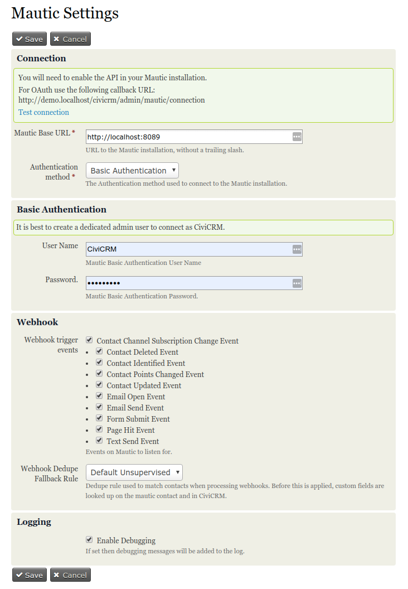
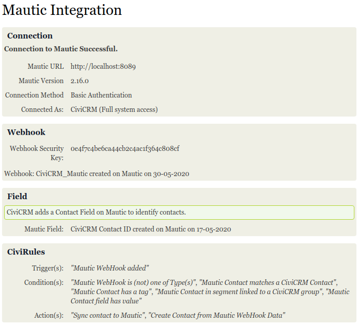
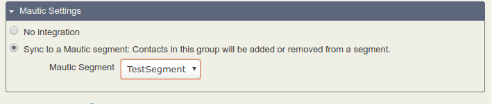
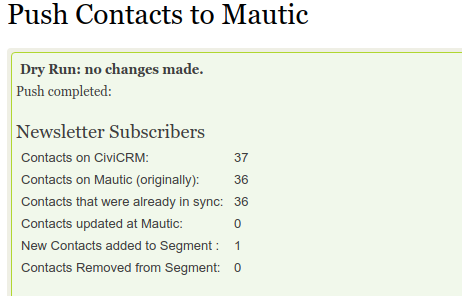

uk.co.vedaconsulting.mautic
==============================
This extension is currently in Alpha. It is not recommended to use this in a production environment.

## Introduction

This extension integrates CiviCRM with [Mautic](https://www.mautic.org), the Open-Source Marketing Automation software.
It currently provides:

 - Push sync contacts from CiviCRM to Mautic. This will synchronize contacts in a
   group to a Mautic segment.
 - A CiviRules Trigger to handle Mautic webhooks.
 - CiviRules Conditions:
   - Mautic Webhook type
   - Mautic Contact matches a CiviCRM Contact
   - Mautic Contact has a tag
   - Mautic Contact field has a particular value
 - CiviRules Actions:
   - Sync contact to Mautic
   - Create Contact from Mautic webhook data

## Prerequisites

You will need full system access to a running Mautic installation.
You may also need filesystem access on the Mautic installation to clear the Mautic cache.

[CiviRules](https://civicrm.org/extensions/civirules) is strongly recommended.

## Installing the extension

1. Download extension from https://github.com/veda-consulting/uk.co.vedaconsulting.mautic/releases/latest.
2. Unzip / untar the package and place it in your configured extensions directory.
3. When you reload the Manage Extensions page the “Mautic Integration” extension should be listed with an Install link.
4. Proceed with install.

For development/testing, a [Docker image](https://hub.docker.com/r/mautic/mautic/) is available with a sample Docker compose file.

## Getting started

### Create a dedicated user on Mautic
On the Mautic installation, create a user with full API, Webhook and Contact permissions.
This will be a dedicated user for the extension.

### Enable Mautic's API
On the Mautic installation, navigate to *Settings -> Configuration -> API Settings*. Toggle 'API enabled' and 'Enable HTTP auth' to 'Yes'.

After these changes, clear the Mautic cache. The easiest way to do this is to go to the  app/cache directory from Mautic filesystem root and delete its content.

### Create Segments
On Mautic, [create one or more segments](https://docs.mautic.org/en/contacts/manage-segments).
Keep the segment simple, without filters.

### Extension Settings
On the CiviCRM installation, go to *Administer -> Mautic -> Mautic Settings*.

Mautic Base URL: *https://my.mautic.installation*
Authentication method: Basic Authentication
Enter the User Name and Password for the  dedicated user created previously.

After you save the settings, the connection status page will confirm successful connection.

## Set CiviCRM Groups

Synching takes place between CiviCRM groups and Mautic segments.
Go to the setting form for a group.
Check *Sync to a Mautic segment:*
Select a Mautic Segment to associate with the group.

## Manual Push Sync

To perform a manual push go to *Administer -> Mautic -> Push to Mautic*.
The page displays the groups to be pushed and the segments to which they are connected.
Check the dry-run option to see what changes would be performed without actually making the change.

The push may take some time, depending on the quantity of contacts in the push-enabled groups.
When the push has completed, you'll see results such as number of contacts created,
unchanged (already in sync), updates and removals.

## Push Sync Scheduled Job

To enable the push sync on a regular schedule, go to *Administer -> Scheduled Jobs*

Find the job *Mautic Push Sync*, and click edit.
Check *is this Scheduled Job active*.

By default the job is set to run daily. If you are setting this to run more frequently, ensure the job has sufficient time
to run.
Alternatively, you can keep the scheduled job disabled and set up a separate system cron job to run the api command *mautic.pushsync* by itself.

## Processing Webhook events with CiviRules

When the extension is initially configured with a connection, it creates a webhook on the Mautic installation.
Webhooks allow CiviCRM to act on changes on Mautic.
You can check the status of the webhook from the CiviCRM installation at: *Administer -> Mautic -> Connection*.
You should see the webhook from the Mautic installation at: *Settings -> Webhooks*.

A (CiviRules)[https://docs.civicrm.org/civirules/en/latest/ "CiviRules Documentation"] trigger is available to process these events.
Typically, you'd create one or more rules with the *Mautic WebHook added* trigger and the *Create Contact from Mautic WebHook Data* to sync contacts into CiviCRM from Mautic, using conditions according to your case.

### Condition: Mautic Webhook type
Use this condition to select which Mautic trigger event types to process in the rule.
Currently you will probably want to respond only to contact-related events.
For example the *Contact Identified Event* will provide data on new Mautic contacts, whereas a *Contact Updated Event* will provide data on changes to existing contacts.

### Condition: Mautic Contact matches a CiviCRM Contact
Use this condition if you want to have different set of actions if the Mautic event concerns a contact that doesn't match an existing contact in CiviCRM.
If you just want to sync the contact and don't need to treat new contacts differently from existing ones then you don't need to use this condition.
The action to create contacts from Mautic can add or update contacts accordingly.

When matching contacts, the extension checks for reference to the contact id on a custom field (2-way).
If a valid reference isn't found, it falls back to a dedupe rule (configured in the main extensions settings).

### Other Condtions
The other conditions are based on various properties of the incoming Mautic contact.
  - Mautic Contact has a tag
  - Mautic Contact field has a particular value
